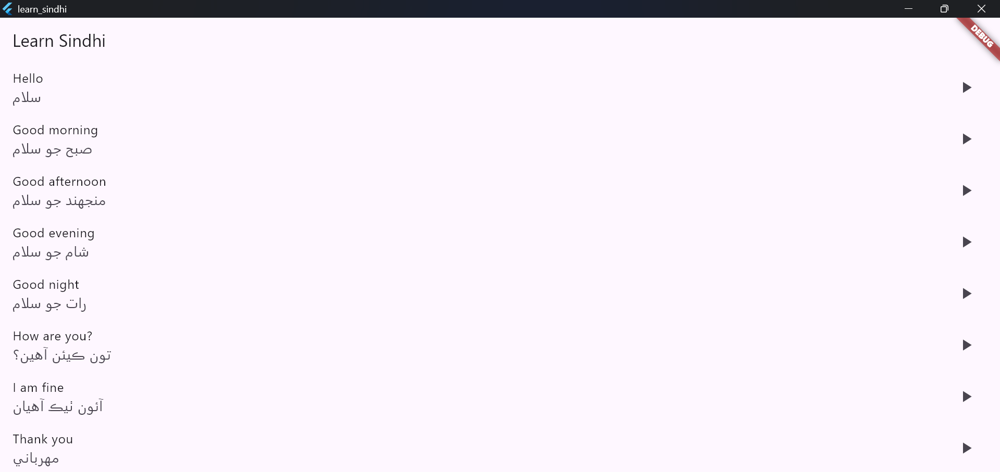
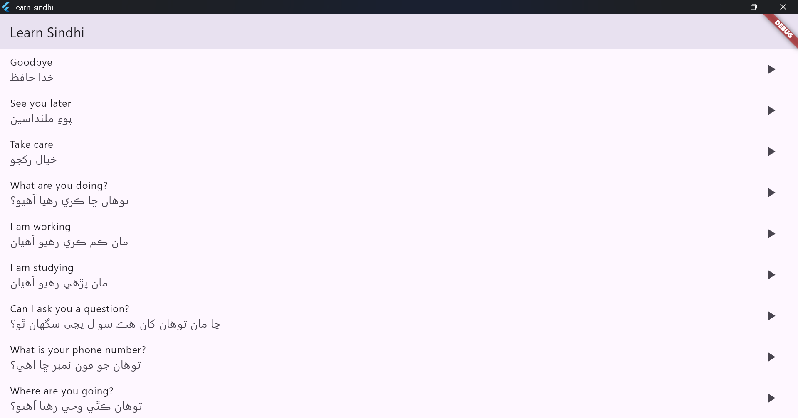

# 🎯 Learn Sindhi

A Flutter-based mobile application that helps you learn 50 essential Sindhi phrases and sentences through daily practice. Perfect for beginners who want to start conversing in Sindhi!


## ✨ Features

- 50 carefully selected daily-use Sindhi sentences
- English translations for each phrase
- High-quality audio pronunciations
- Simple and intuitive user interface
- Offline functionality
- Easy-to-use audio playback

## 📱 Screenshots




## 🚀 Getting Started

### Prerequisites

- Flutter SDK (latest version)
- Android Studio / VS Code
- Git

### Installation

1. Clone the repository
```bash
git clone https://github.com/yourusername/Learn-Sindhi.git
```

2. Navigate to the project directory
```bash
cd Learn-Sindhi
```

3. Install dependencies
```bash
flutter pub get
```

4. Run the app
```bash
flutter run
```

## 📖 What You'll Learn

- Basic greetings and introductions
- Common questions and responses
- Essential phrases for daily communication
- Emergency and health-related expressions
- Numbers and basic conversations

## 🎯 Target Audience

- Beginners interested in learning Sindhi
- Travelers to Sindhi-speaking regions
- Language enthusiasts
- Anyone wanting to connect with Sindhi speakers

## 🤝 Contributing

Contributions are what make the open source community such an amazing place to learn, inspire, and create. Any contributions you make are **greatly appreciated**.

1. Fork the Project
2. Create your Feature Branch (`git checkout -b feature/AmazingFeature`)
3. Commit your Changes (`git commit -m 'Add some AmazingFeature'`)
4. Push to the Branch (`git push origin feature/AmazingFeature`)
5. Open a Pull Request

## 💡 Acknowledgments

- Special thanks to Dr. Muzassir Raza for the inspiration and motivation
- Built with Flutter and ❤️ in one day!
- Audio pronunciations provided by native Sindhi speakers

## 📄 License

Distributed under the MIT License. See `LICENSE` for more information.

## 📞 Contact

Abu Bakar - [@LinedIn](https://www.linkedin.com/in/abubakar56/)

Project Link: [https://github.com/abubakarp789/Learn-Sindhi](https://github.com/abubakarp789/Learn-Sindhi)

---

### 🌟 From Zero to App in One Day!

This project was created as a challenge to build a functional app in just one day! It demonstrates the power of Flutter and the possibility of turning ideas into reality quickly.
